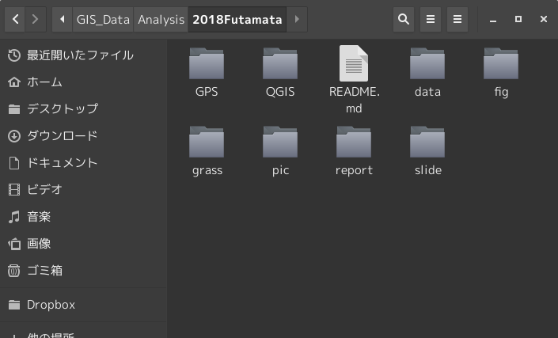
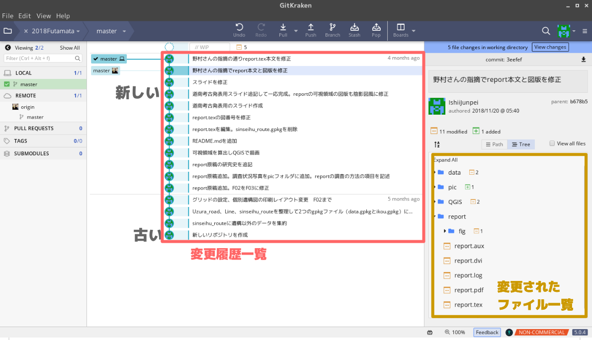
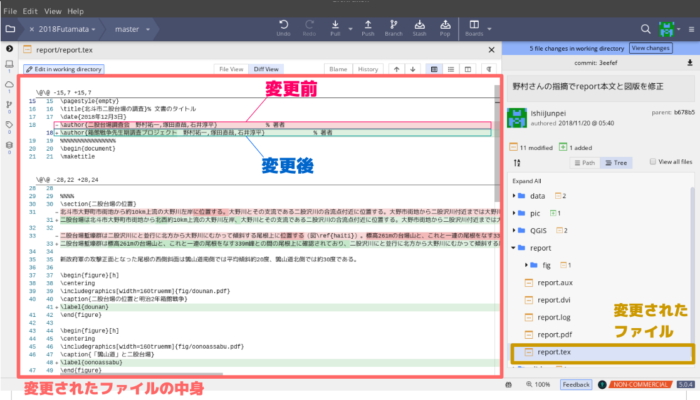
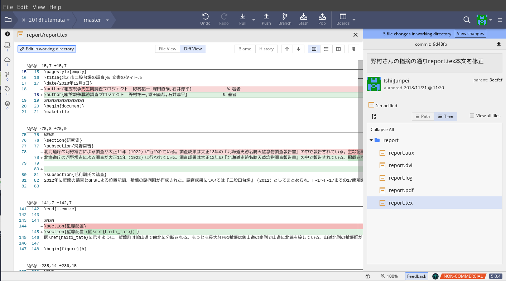
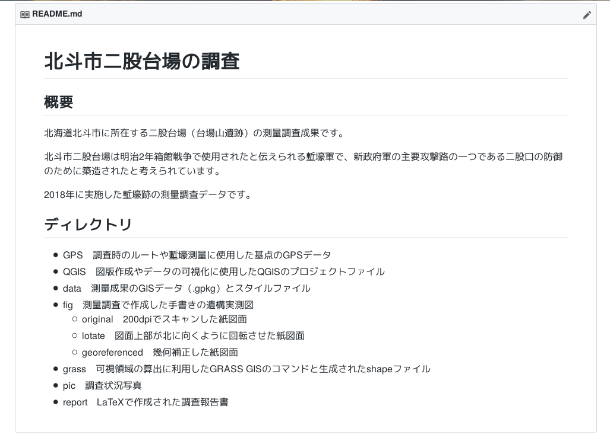
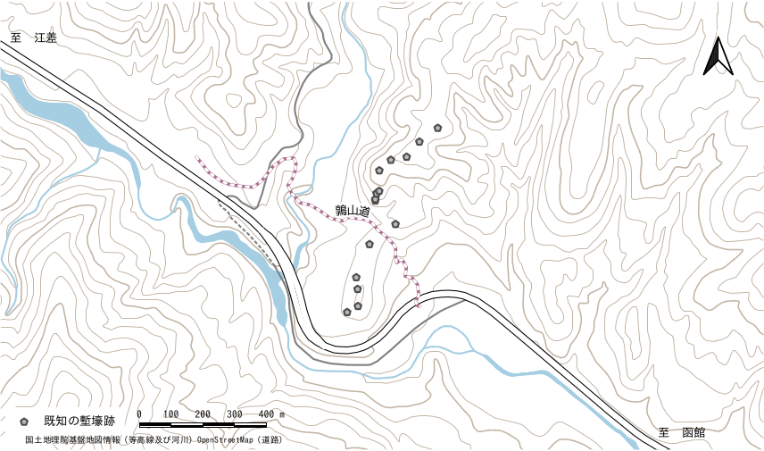
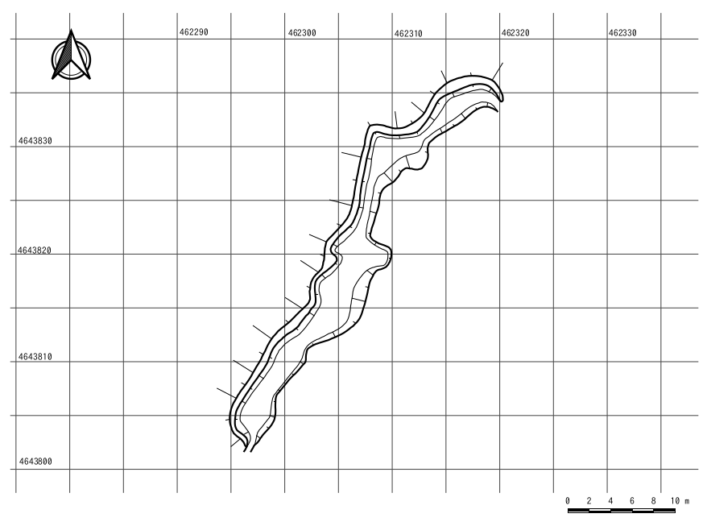

# 考古学情報の再現可能性

### 〜バージョン管理システムGitを利用した調査データの管理と公開〜

### 当日発表スライド

[https://ishiijunpei.github.io/2019kyoukai/](https://ishiijunpei.github.io/2019kyoukai/)

### 口頭発表原稿

## はじめに
本報告では、考古学情報を公開することの意義について私の考えを説明するとともに、公開するための現実的な方法について提案を行います。

図書として刊行された考古学情報、多くは発掘調査報告書という体裁をとっていますが、それらは情報の固定化という面で優れています。一方、報告書作成に利用された調査記録や中間成果物へのアクセシビリティが低く、情報の再現性が低いことが問題と考えています。情報の再現性とは、誰もが最終成果物と同じ情報を作成可能である状態のことを指します。私は情報の再現性を保つことは考古学情報の真正性を評価する上で重要であり、考古学情報の公開の意義はここにあると考えています。考古学情報は最終成果物とともに、オリジナルのデータや中間成果物もあわせて公開することが必要となります。私が今回提案したいことは、考古学情報のオープンデータ化ということです。

そのための方策として、GitHubに代表されるバージョン管理と共有サービスの仕組みを活用した実践事例を報告させていただきます。Gitを使用し、一次情報である現場図面や写真、最終的な報告書に至る中間成果物すべての改変履歴を記録することで考古学情報の真正性と再現可能性が担保されると考えています。また、Gitの機能を利用したウェブサービスであるGitHubにより考古学情報の作成に関わった調査記録の公開を容易に実現することができます。

本報告では、北海道南部の箱館戦争遺跡の調査におけるGitによるバージョン管理とGitHubを利用したデータ共有の実践例を紹介し、手法やノウハウを報告させていただきます。

## 媒体論ではない
考古学情報の保存と公開に関して、これまでは媒体論が主要な議論となっていた経過があるように思います。私にとって考古学情報の保存・公開に用いられる媒体については、紙であるかPDFであるか、あるいは電子データのメディアがCDであるかSSDであるかということは特に問題ではありません。これらの媒体論は情報の再現可能性の議論とは無関係です。

## 文化庁の立場
一方、考古学情報における紙媒体（あるいはPDF）について文化庁は「刊行後の改変が困難であるため,情報の真正性が確保できる」（文化庁2017,p12）としていますが、「真正性」の定義が私とは異なっていますので、考古学情報の再現可能性の議論の文脈に負いては、必ずしも肯定することはできません。私は考古学情報作成に関わる一次情報や中間成果物を再利用可能なデータ群として流通させることが考古学情報の「真正性」確保と考古学情報の社会的利用のために必要と考えており、この点で、私のいう考古学情報の真正性と文化庁のいう真正性の定義は根本から異なっている、ということを申し上げておきます。

## 情報処理プロセスの透明性
具体的な例をあげて筆者の真正性に関する考え方を一つ示させていただきます。遺物の整理分類に使用された「遺物台帳」を元に作成された遺物集計表が報告書に掲載されているとします。しかし、最終的な報告書しか手にすることができない者にはこれらの集計作業が適切に行われたかどうかを判断するすべはありません。そのような場合、その考古学情報の「真正性」を評価することはできない、というのが私の考え方です。適切なプロセスで最終的な集計表がつくられているかどうかを第三者が点検できる環境、「情報処理プロセスの透明性」を構築することが真正性を評価するために必要だ、ということが私の考えです。

## 考古学情報の「真正性」

私の言う考古学情報の「真正性」を文化財における「真正性（authenticity）」に引きつけて表現すると次のようになるかと思います。

- 考古学情報の価値は真正性によって評価される
- そのためには考古学情報の作成に使用された情報源が信頼できる度合いが評価されなければならない
- どのようなプロセスで考古学情報が作成されたのかに関する情報が真正性の評価には必須である

## 考古学情報作成プロセス
すなわち、考古学情報作成プロセスを明示することが、考古学情報の真正性を評価するための第一歩となります。どのような調査記録が選択され、どのような処理を経て最終的な考古学情報として成立したのかということに関する情報が真正性を評価する基本になると私は考えています。

## 改変可能性と再現可能性
オリジナルのデータの改変可能性をなくすことが真正性を担保する方策だ、という考え方には一理あります。発掘調査の結果が一意に決まる状態を維持することは、調査成果の利用に当たって無用な混乱を防ぐ効果があります。しかし、そのための答えが印刷物だけであるとは考えません。なにより、PDFや印刷物はデータの再利用可能性や再現可能性に限界があり、調査記録の多くが電子データを媒介にしていることを考えると大きな社会的損失です。要するに、再現可能性を高く保ちつつ改変のリスクを抑える方法があればよい、というわけです。そのための回答の一つがGitHubを利用した考古学情報管理であると考えています。

## 情報とデータ
ここまで、「情報」、「データ」、「記録」という用語を説明なしに使用してきましたが、あらかじめ、定義を述べておきます。日本工業規格の定義はややわかりにくいのですが、情報は「文脈に依存して一定の意味をもつ」知識、データは「解釈を必要とする」知識と整理したいと思います。

具体例をあげれば、出土遺物の地点を記録した一覧表はデータ、その中から接合した土器だけを抜き出して表示したものは情報に当てはまります。もちろん、遺物実測図のように作成当初から解釈を含むものはデータとしての側面と情報としての側面がありますので、ある特定の記録がデータであるか情報であるか、ということは一義的には決まらないという性格のものです。

いずれにせよ、図書として刊行された発掘調査報告書は「情報」の塊であって、その作成には多くのデータが背後にあるという構造を認めることができると思います。

## GitHub
ここからは私が考える調査記録の再現可能性と改変不可能性を両立させる方法としてGitというソフトウェアとGitHubというウェブサービスの利用を紹介します。Gitを使うことによって「どのような改変が」、「いつ」、「誰によって」行われたのかが明確になります。そして、GitHubはGitに記録された変更履歴をもったデータ群をウェブ上で閲覧やダウンロードできるサービスです。

## Gitとディレクトリ

Gitの主な機能は情報の変更単位ごとに履歴を作成することでです。ディレクトリ全体のバックアップをとるようなイメージになります。Gitによる変更履歴の登録によって「いつ、どのような変更が、誰によって行われたのか」ということが明確になります。その結果、最終成果物からは知ることができない考古学情報編集作業の工程と使用されたデータがGitの履歴に残されます。さらに、Gitには消去、改変された過去の記録も潜在的に保存されています。つまり、考古学情報作成にかかわる全ての記録がGitに保存されることとなります。情報の再現可能性と改変不可能性を両立させる条件が整っているものと考えます。

また、ディレクトリのウェブ共有の側面だけをみれば、グーグルドライブやドロップボックスなどとよく似た機能を提供しているといえます。

## 二股台場調査でのGit利用
筆者らが取り組んでいる北海道北斗市二股台場の測量調査では、GitHubによる調査記録の共有と公開を行っています。

調査関係者が日常的に顔をあわせて作業する環境にないため、調査情報をリモートで共有する必要があったこと、複数の調査者が調査記録の編集に関わることから、作業重複を避ける工夫が必要となりました。Gitの導入はそうした状況での調査記録更新にかかる公正性の確保と作業重複の回避が主な目的でした。

## コマンドラインでの操作
Gitはコマンドラインで操作されることが多く、筆者も基本的にはコマンドラインで操作しています。
ただし、Gitには秀逸なGUIクライアントソフトが数多く開発されていますので、これらのソフトウェアによりGitを直感的に操作することが可能です。

基本的な流れとしては、作業開始前にアップロードされた変更を取得します。「push」というコマンドでGitHubにある新たな変更がダウンロードされ、自分のコンピュータのディレクトリとgithubの中身が一致します。

```
## 他の人がアップロードした変更内容を取得
git pull
## ディレクトリのすべてのファイルをリポジトリに登録
git add .
## 変更結果をローカルリポジトリにコミット
git commit -m F02平面図を修正
## 変更内容をアップロード
git push origin master

```

## GitKraken



GitKrakenはgitのクライアントソフトです。中央に変更履歴のツリーが表示されています。この状態は最新の一つ手前の状態でコメントを見ると「report本文と図版を修正」と記入されています。右側には変更されたディレクトリやファイルの一覧が表示されます。


## GitKraken
この中から「report.tex」というファイルを選択すると中央にファイルの内容と変更履歴が表示されています。変更箇所は2段書きされていて、上の赤字部分が修正前、緑字が修正後となっています。このときは「二股台場調査会」という名称を「函館戦跡戦跡調査プロジェクト」という名称に変更しようとしたものです。しかし、「戦跡」と入力すべきところが「先生」とご入力されてしまっているのを気づかずにそのまま登録したものです。



## 恥ずかしい修正履歴も残る



この誤字は最後には修正していますが、こうした誤りの履歴も残されるという点はどのような処理をして最終的な成果物ができたのか、なぜそのようなプロセスを経たのかということが履歴から判断できるという点で、再現可能性と改変への抑止力を高めていると判断しています。

## GitHubで履歴とともに公開
ウェブにアップロードされたGitHubのデータです。多少見た目は変わっていますが、GitKrakenの表現と基本は一緒です。
中央のペインに最新の変更時点のディレクトリが表示されています。右側の「Clone or download」をクリックするとディレクトリ全体をダウンロードします。デフォルトではディレクトリの下方にREADMEファイルに記述された内容が表示されます。ディスクリプションとかアブストラクトのような内容を記載することが一般的です。



## オープンデータとしての考古記録

以上のように、考古学情報をその作成プロセスを含めて管理すること、さらにそれらを公開して、全てのデータにアクセスできる環境を構築することが、考古学情報の真正性を高めるとともに、再現可能性を高めるものと考えています。それは、現場図面のような記録、それらを利用して作成される素図や第二原図のような中間成果物とその作成プロセスです。

紙媒体によって「情報を固定化する」というアイディアは、文化財保護に例えると「凍結保存」の概念と同一です。もちろん間違いではありませんが、それが唯一の方法ではなく、情報の固定化による社会的損失を考慮すべき時期にきていると考えます。考古学情報作成プロセスを明らかにし、全てのデータにアクセスできる環境を構築することは、すでに技術的には可能となっているばかりでなく、それ自体が重要な社会資本となっているのが現実です。

## 考古記録の自由な利用
オープンソースのソフトウェアのソースコードから必要な部分を切り取って自由に利用できるようになったことで、コンピュータソフトウェアの開発が大きく進んだのと同じように、考古学情報に関わる調査記録や中間成果物を自由に利用できる学問上のメリットははかりしれないと考えています。

発掘調査報告書という考古学のフィルターのかかった情報だけでなく、生のデータを非専門家が利用できるようになることは、考古学の成果を社会に還元する大きな手法であるとともに、我々にも新たな視点を提供することで考古学にも大きな成果をもたらすと考えています。

たとえば、地質図はすでにGISデータでダウンロードし、自由に利用することが可能です。我々は地質の専門家ではありませんが、地質図データを利用できる大きなメリットがあることは理解できます。同様に、考古記録も異なる分野で利用可能な形態で提供することで新たな活用につながると確信しています。

厳しい言い方をすれば、公金を使用して発掘調査を行い、その成果が考古学という学問分野の専門家のみが理解できる形で流通させれば良い、という考え方には行政の一端にいるものとして、賛成できません。

## オープンな記録の作成
データをオープンにするにあたり、もう一つ考えておかなければならないのは、データそのものを自由に利用できる形態で提供することです。

具体的には、特定のイラストソフトでしか開けない実測図でデータが公開されていても活用の幅は極めて限定されます。確かにイラストソフトはとても便利なものですが、そもそも、現在の発掘調査現場ではトータルステーションなどを活用したデータ取得を行うことも相当多いと感じています。位置情報をもったデータで入力されているのに、わざわざそれを紙媒体への出力を前提としたイラストソフトで編集する意味がよくわかりません。

## CADやGISの活用
CADやGISデータでは規格が公開されたデータ形式が準備されており、ソフトウェアの種類を問わずに利用することができていいます。少なくとも遺構図面に関してはCADやGISのデータで編集し流通させることが必要だと感じています。

私はQGISというGISのソフトを最近では遺構図面作成に利用しています。行こうずに必要な情報は何かと考えた場合、GISのソフトの表現力は必要にして十分なものであると感じています。





## ご清聴ありがとうざいました
拙い報告を最後までお聞きただきありがとうございます。考古学情報の真正性を高めるための考え方として、再現可能性を示させていただきました。そのためには、原データや中間成果物へのアクセスが必要であり、そうした考古学情報作成プロセス全体を管理・公開する仕組みとしてGitHubを紹介させていただきました。

また、考古学情報作成プロセスが公開されることによって、考古記録の再利用可能性が高まるものと考えています。考古記録が国土の基本情報として非専門家にも活用されることが、考古記録の目指すべき姿であると信じています。

ご清聴ありがとうございました。

